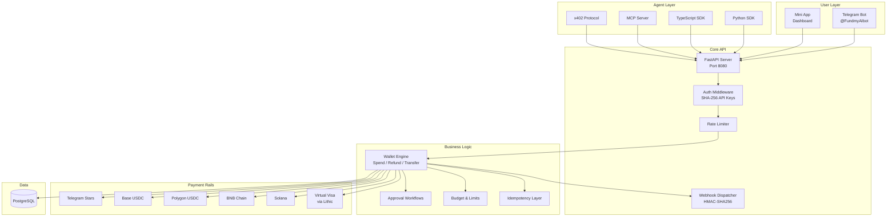
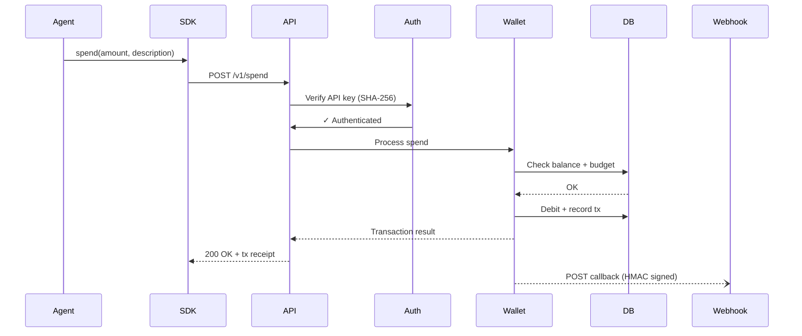

# AgentPay Architecture

## System Overview



## Request Flow



## Component Responsibilities

| Component | Role |
|-----------|------|
| **Telegram Bot** | User-facing: create agents, fund wallets, set rules, view history |
| **Mini App** | 5-tab dashboard: overview, agents, transactions, wallets, settings |
| **FastAPI API** | 24+ REST endpoints, OpenAPI docs at `/docs` |
| **Python SDK** | Sync + async client, retries, typed responses |
| **TypeScript SDK** | Full client, webhook verification, retry with backoff |
| **MCP Server** | Tool definitions for AI agent frameworks (stdio + HTTP) |
| **x402 Protocol** | HTTP 402-based pay-per-request for web services |
| **Wallet Engine** | Core ledger: spend, refund, transfer, multi-chain |
| **Approval Workflows** | Human-in-the-loop for high-value transactions |
| **PostgreSQL** | Persistent storage: agents, wallets, transactions, keys |

## Deployment

```
Cloudflare Tunnel (leofundmybot.dev)
  └─► API (port 8080)
       ├─► /v1/*    → REST API
       ├─► /app/*   → Mini App (static)
       ├─► /        → Landing page
       └─► /docs    → OpenAPI docs
```

## Security Model

- **API Keys**: SHA-256 hashed at rest, never stored plaintext
- **Wallet Encryption**: Fernet + PBKDF2 for private keys
- **Webhooks**: HMAC-SHA256 signed, timing-safe verification
- **Rate Limiting**: Per-key and global limits
- **CORS**: Locked to allowed origins
- **Idempotency**: Duplicate request protection via idempotency keys

See [Security Architecture](security-architecture.md) for full details.
